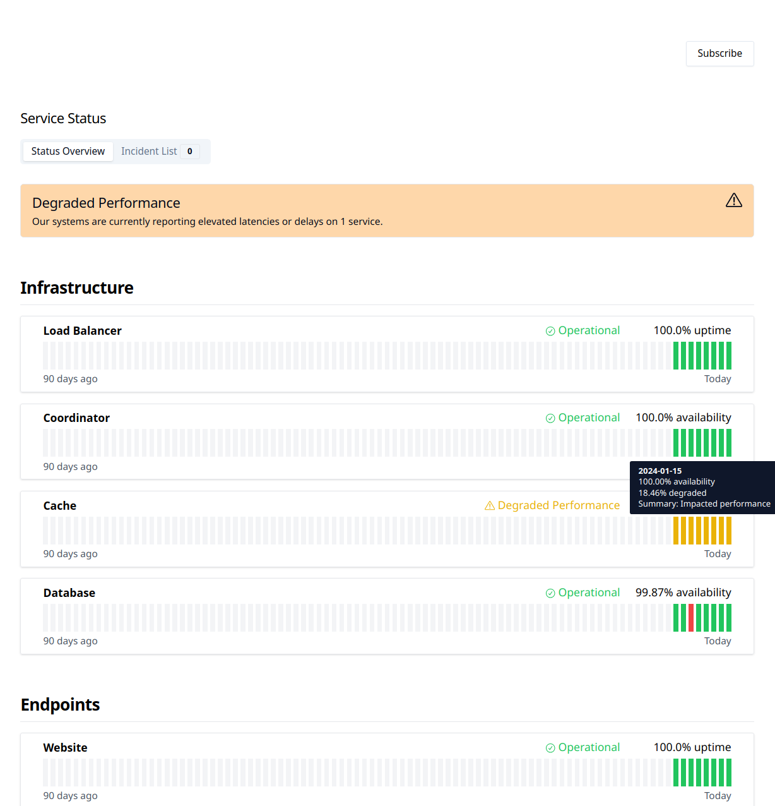
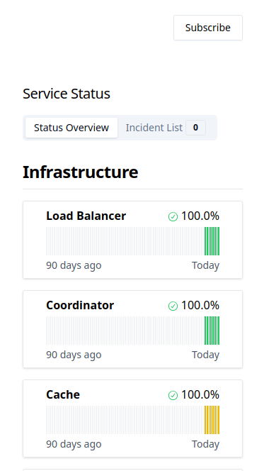

# Simple Status Page

## Introduction

**Simple Status Page** is a Koa.js and React Vite (with [shadcn-ui](https://github.com/shadcn-ui/ui)) based monitoring
application for tracking the status of services through HTTP and API endpoints. It utilizes a SQLite database for
storage and is configured via a YAML file, streamlining the setup process. This application is deployable using Docker.

## Features

- **Monitor Types:** 'http' for checking HTTP endpoints and 'api' for receiving external status updates.
- **Docker Deployment:** Easy setup with Docker and Docker Compose.
- **Customizable Configuration:** Managed through a single YAML file.
- **Basic Database Migration:** A very simple database migration class that creates / updates the SQLite schema if
  required.
- **Planned Features:**
  - Ping monitor type.
  - Additional notification providers/integrations.
  - Interface for manual incidents and scheduled maintenance.
  - Optional graphing for metrics such as latency or load.

## Frontend Screenshots

|  |  |
| :------------------------------: | :----------------------------: |
|           Desktop View           |          Mobile View           |

## Monitor Types and Functionality

**Simple Status Page** currently supports two primary types of monitors: `http` and `api`. Each type has its unique way
of monitoring and reporting the status of your services.

### HTTP Monitor

- **Functionality**: The `http` monitor type periodically makes HTTP requests to a specified endpoint and checks if the
  response (optional) and status codes are as expected.
- **Retries**: If a check fails (e.g., incorrect response or status code), the system will retry (after waiting for
  `checkInterval`) the check based on the configured `retries` number before marking the service as down.
- **Configuration**: Set the endpoint URL, expected response (using a regular expression), and valid status codes in the
  configuration file.

### API Monitor

- **Functionality**: Unlike the `http` monitor, the `api` monitor type is designed to be called externally. It allows
  external systems to report the status of a service.
- **Retries**: For `api` monitors, the retry count increments if the time since the last call exceeds the
  `checkInterval`. If it surpasses the configured `retries` count without a status update, the service is considered
  down.
- **Endpoint Call**: To update the status of an `api` monitor, make an HTTP request to
  `http://[basedomain]/api/monitor/[uuid]?status=[status]&value=[value]`.
  - `uuid`: Unique identifier for the monitor, keep this private.
  - `status`: The status of the monitor (`up`, `down`, or `degraded`).
  - `value`: Optional numeric value providing additional data (currently not used but stored in the database).

### Monitor Status and Incidents

- Both monitor types support optional incident tracking. Incidents can be automatically created and resolved based on
  the monitor's status over time, as defined in the `incidents` configuration.
- `createAfter`: Number of consecutive failure checks required before creating an incident.
- `resolveAfter`: Number of consecutive successful checks required before resolving an incident.

## Configuration Guide

The application is configured through the `data/config.yaml` file. Below is a detailed explanation of the configuration
parameters:

- **public**:

  - `favicon`: Custom favicon in SVG format.
  - `logo`: Custom logo in SVG format.
  - `companyName`: The name displayed on the status page.
  - `refreshInterval`: Time interval (in seconds) for the status page to refresh.
  - `basedomain`: The base URL where the application is hosted.

- **salt**:

  - A string used for hashing (e.g., in email confirmation links).

- **database**:

  - `path`: The file path for the SQLite database.

- **smtp**:

  - `host`: SMTP server host.
  - `from`: Email address used for sending notifications.
  - `port`: SMTP server port.
  - `username`: SMTP server username.
  - `password`: SMTP server password.

- **groups**: (array of groups)

  - Each group has:
    - `name`: Name of the group.
    - `monitors`: Array of monitor IDs included in the group.

- **monitors**: (array of monitors)
  - Each monitor has:
    - `name`: Name of the monitor.
    - `id`: Unique identifier for the monitor.
    - `uuid`: A unique identifier for this monitor.
    - `description`: Optional description of the monitor.
    - `visible`: Determines if the monitor is visible on the status page.
    - `type`: Type of monitor (`http` or `api`).
    - `url`: (for HTTP monitors) The URL to check.
    - `regexp`: (optional, for HTTP monitors) Regular expression to match in the response body.
    - `validStatusCodes`: (optional, for HTTP monitors) Array of HTTP status codes considered valid.
    - `checkInterval`: Time interval (in milliseconds) for performing checks.
    - `retries`: Number of retries before a check is considered failed.
    - `timeoutDownMs`: HTTP request timeout (in milliseconds) for a down status.
    - `timeoutDegradationMs`: HTTP request duration (in milliseconds) for a degraded status.
    - `incidents`:
      - `down`: Settings for down status incidents.
      - `degraded`: Settings for degraded status incidents.

## Building and Running the Project

### Prerequisites

- Node.js (v18+ recommended)
- npm

### Installation

1. Clone the repository.
2. Install dependencies for backend and frontend:
   ```sh
   npm run dependencies
   ```

### Building the Application

Build both the backend and frontend:

```sh
npm run buildall
```

### Running the Application

Start the server:

```sh
npm run start
```

## Running with Docker Compose

1. Ensure Docker and Docker Compose are installed on your system.
2. Prepare your `data/config.yaml` file and make sure the directory writable for the SQLite database
3. Run the following command in the project's root directory:
   ```sh
   docker-compose up
   ```
   _The container will mount `data/` locally to read the `config.yaml` and create / store the database._

## Optional: Setting Up Nginx Reverse Proxy with HTTPS (Debian/Ubuntu)

**Note:** _This is a very basic example of how to configure nginx with letsencrypt as reverse proxy._

### Step 1: Install Nginx and Certbot

1. Update your package list:
   ```sh
   sudo apt-get update
   ```
2. Install Nginx:
   ```sh
   sudo apt-get install nginx
   ```
3. Install Certbot and the Nginx plugin:
   ```sh
   sudo apt-get install certbot python3-certbot-nginx
   ```

### Step 2: Configure Nginx

Create a new Nginx server block configuration:

1. Go to the `sites-available` directory:
   ```sh
   cd /etc/nginx/sites-available/
   ```
2. Create a new configuration file (e.g., `simple-status-page`):
   ```sh
   sudo touch simple-status-page
   sudo nano simple-status-page
   ```
3. Add the following configuration:

   ```nginx
   server {
       listen 80;
       server_name example.com www.example.com; # Replace with your domain

       location / {
           proxy_pass http://localhost:3000; # Assuming your app runs on port 3000
           proxy_http_version 1.1;
           proxy_set_header Upgrade $http_upgrade;
           proxy_set_header Connection 'upgrade';
           proxy_set_header Host $host;
           proxy_cache_bypass $http_upgrade;
       }
   }
   ```

4. Enable the configuration by linking it to the `sites-enabled` directory:
   ```sh
   sudo ln -s /etc/nginx/sites-available/simple-status-page /etc/nginx/sites-enabled/
   ```
5. Test the configuration for syntax errors:
   ```sh
   sudo nginx -t
   ```
6. Reload Nginx to apply the changes:
   ```sh
   sudo systemctl reload nginx
   ```

### Step 3: Obtain SSL Certificate with Certbot

1. Run Certbot to get an SSL certificate and configure Nginx to use HTTPS:

   ```sh
   sudo certbot --nginx -d example.com -d www.example.com
   ```

   Replace `example.com` and `www.example.com` with your domain name.

2. Follow the prompts to configure your certificate. Certbot will automatically modify your Nginx configuration to serve
   your site over HTTPS.

### Step 4: Automatic Certificate Renewal

Certbot sets up a cron job or systemd timer for renewing certificates that are near expiration. You can test the
automatic renewal process with:

```sh
sudo certbot renew --dry-run
```

---

With these steps, your Nginx server will now act as a reverse proxy to your Docker container and serve your application
securely using HTTPS. Remember to replace `example.com` with your actual domain and adjust the port number (`3000`) if
your application is running on a different port.

## License

This project is released under the MIT License.
